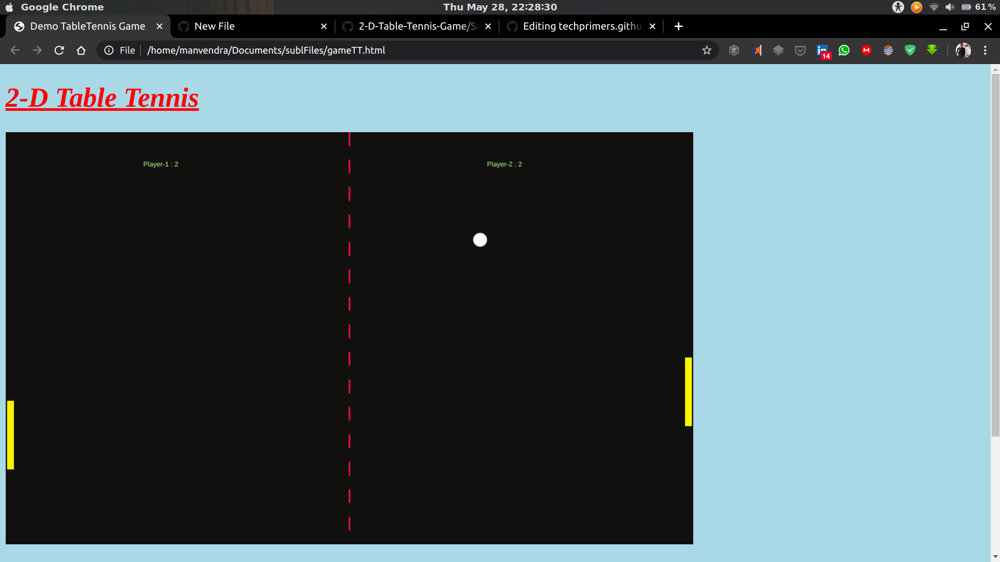
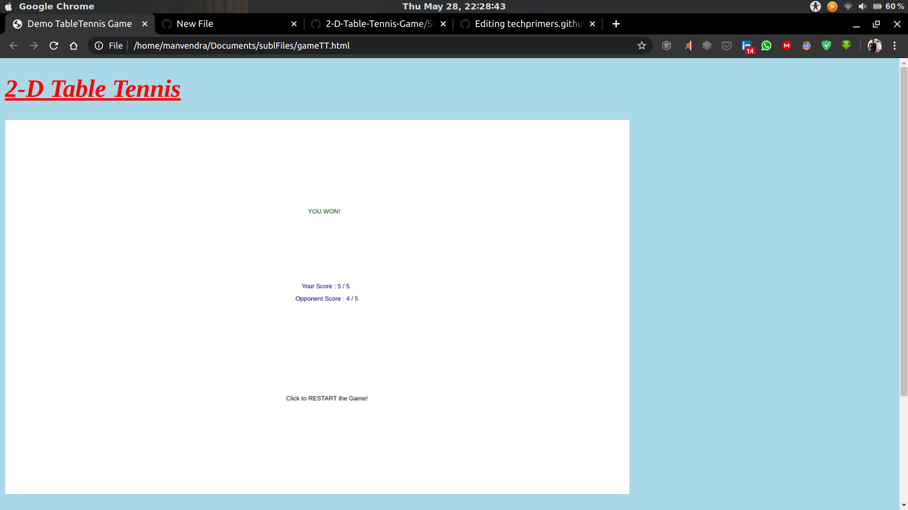

# 2-D-Table-Tennis-Game
A Web-Dev oriented Game which is primitively found in Cellphones.

[Go to the Testing Web Site](https://manvendra264.github.io/2-D-Table-Tennis-Game/)

## Motivation :
Contribution brings happiness to world and learning new things leads to skill development!

## Objective :
The main objective is to get familiar with Game Programming.
>(i) It really brings back the memory of playing that outdated game in Cellpones.
>(ii) Nowadays, the time is running at great pace but this may reminds us about childhood memories.

## Tools Used :
Just any Text-editor, I prefer Sublime text and Web Browser, e.g. Chrome,Safari,Firefox,etc.

## Programming Language Used :
HTML CSS, and Javascript.

## ScreenShots :
1) Pic. showing how Game starts. 

2) Pic. showing after Game ends.

Feel free to just add the `.md` file alone.
